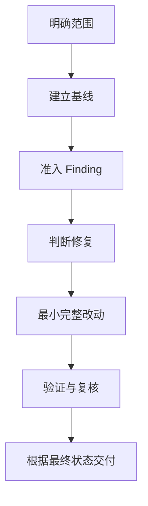

<h1 align="center">🛠️ 代码整理修复大师 · Codebase Convergence</h1>

<p align="center">
  <strong>修复真实问题，让代码、文档和验证回到一致、简洁、可维护的状态。</strong>
</p>

<p align="center">
  <sub>精准修复 · 代码审核 · 架构收敛 · 文档一致 · 可执行验证</sub>
</p>

<p align="center">
  <a href="#capabilities">🎯 核心能力</a> ·
  <a href="#quick-start">🚀 快速开始</a> ·
  <a href="#workflow">🧭 工作流程</a> ·
  <a href="#verification">🧪 基本验证</a> ·
  <a href="#structure">📁 项目结构</a> ·
  <a href="#sources">🤝 来源</a>
</p>

<p align="center">
  
  
  <a href="https://github.com/XiaoSiKe/codebase-convergence/actions/workflows/validate.yml"></a>
</p>

---

<a id="capabilities"></a>

## 🎯 围绕真实问题收敛项目

`codebase-convergence` 是一个可在日常开发中反复调用的 Codex Skill。它用于修复 Bug、审核代码、整理重复与矛盾，以及收敛局部或整个项目。

| 核心 | 关注的问题 | 产生的结果 |
| --- | --- | --- |
| 🎯 **精准执行** | 该不该改、改多少、如何证明 | 有证据、可追溯、可验证的最小完整修复 |
| 🧩 **深 Module 收敛** | 复杂度、规则和失败处理应该由谁承担 | 更小的 Interface、更高的 Leverage 和更集中的 Locality |

Finding、证据指纹、规范来源和专业路由为这两项核心提供支撑。实际修复仍以当前仓库的规则、代码和可执行检查为准。

<a id="quick-start"></a>

## 🚀 快速开始

### 安装到 Codex

```bash
git clone https://github.com/XiaoSiKe/codebase-convergence.git
cd codebase-convergence

python3 scripts/install_local.py --dry-run --target ~/.codex/skills/codebase-convergence
python3 scripts/install_local.py --install --target ~/.codex/skills/codebase-convergence
python3 scripts/install_local.py --check --target ~/.codex/skills/codebase-convergence
```

安装器支持缺失或空的目标目录，也能更新没有本地改动的托管安装。预览空目录时，JSON 结果使用 `status: "empty"`；未托管的非空目录、本地已改动文件和符号链接会被保留并报告。

### 发起一次收敛

```text
使用 $codebase-convergence 修复这个 Bug，复现后检查相同根因在相关 Module、调用方和测试中是否还存在。
```

```text
使用 $codebase-convergence 只读审核这个范围，报告 Bug、矛盾、重复知识、浅 Module 和未覆盖风险。
```

```text
使用 $codebase-convergence 整理并收敛整个项目，只实施有证据、已授权且经验证的最小完整修复。
```

<a id="workflow"></a>

## 🧭 工作流程



工作流先确认问题和规范来源，再实施最简单的完整修复。当请求的验收、相关回归和必要检查已通过时即进入交付；只有具体失败或未解决风险才扩大验证。

<a id="verification"></a>

## 🧪 基本验证

```bash
python3 -m unittest discover -s tests -v
python3 /path/to/skill-creator/scripts/quick_validate.py codebase-convergence
python3 scripts/eval_cases.py validate-cases
python3 scripts/eval_cases.py result-contract
```

单元测试覆盖技能包、只读证据工具、安装保护和评测基础设施。评测目录校验只检查案例结构与安全不变量，不执行独立编码代理。

<details>
<summary><strong>确定性工具</strong></summary>

### 收集仓库证据

```bash
python3 codebase-convergence/scripts/collect_evidence.py --root /path/to/repository --pretty
```

输出包含清单、Git 基线和工作树指纹。它用于标识观察对象，不机器判定正确性。

### 记录并检查 Finding

```bash
python3 codebase-convergence/scripts/finding_contract.py stamp --root /path/to/repository --finding /tmp/finding-draft.json
python3 codebase-convergence/scripts/finding_contract.py check --root /path/to/repository --finding /tmp/finding.json
```

Finding 合同校验结构、安全路径和证据新鲜度。完整字段与限制见 [Finding 指南](codebase-convergence/references/finding-contract.md)。

### 物化评测夹具

```bash
python3 scripts/eval_cases.py materialize --case numeric-conflict --output /path/to/empty-directory
python3 scripts/eval_cases.py validate-result --case numeric-conflict --result /tmp/result.json --workspace /path/to/empty-directory
```

`validate-result` 会把上报的 `changed_files` 与夹具的真实净变化对账。

</details>

<a id="structure"></a>

## 📁 项目结构

```text
codebase-convergence/
├── SKILL.md                  # 精简的核心原则与导航
├── agents/openai.yaml       # 中文展示名与默认调用提示
├── references/              # 工作流、架构、文档、路由、Finding 与来源
└── scripts/                 # 只读证据采集与 Finding 指纹校验
CONTEXT.md                   # 本仓库的领域术语和维护不变量
evals/                       # 不向被测代理泄露答案的行为评测
scripts/                     # 评测夹具与安全安装工具
tests/                       # 无第三方依赖的确定性测试
```

Skill 的行为规范以 [`codebase-convergence/SKILL.md`](codebase-convergence/SKILL.md) 为入口，详细执行步骤由 [Execution workflow](codebase-convergence/references/execution-workflow.md) 维护。

<a id="sources"></a>

## 🤝 来源与致谢

README 的居中标题、导航和徽章排版参考了 [Project Evolution Engine](https://github.com/XiaoSiKe/project-evolution-engine)。最终交付规则根据 [No Negative Echo](https://github.com/LB623/no-negative-echo) 的核心思路重新组织。

固定提交、改写范围和上游许可见 [来源说明](codebase-convergence/references/sources.md)。

---

<p align="center">🛠️ 修好真问题，收回复杂度，让下一次修改更容易。</p>
